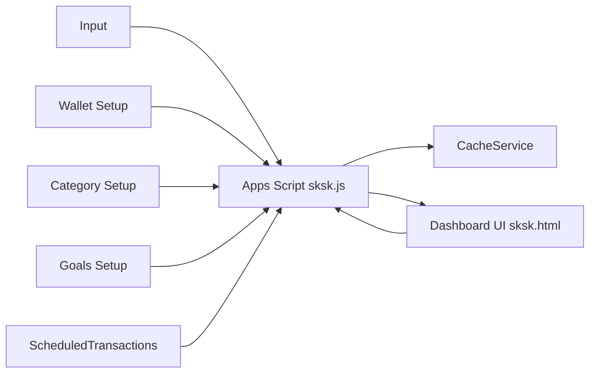

# SatukasSatukas — Script Documentation

Ringkasan singkat: repo ini adalah Google Apps Script (bound) yang menjadi backend untuk Dashboard (sksk.html). Script mengambil data dari Google Sheet (sheet `Input`, `Wallet Setup`, `Category Setup`, `Goals Setup`, `ScheduledTransactions`) lalu memprosesnya menjadi KPI, snapshot NetWorth, sankey, tree map, budget, dll.

## Komponen utama
- **Master Script Backend.gs** — backend utama (Apps Script)
  - doGet(e) — serve frontend + manifest + service-worker
  - getDashboardData(period, filters, forceRefresh) — entry point frontend -> backend
  - getRawSheetData_(sheetName, forceRefresh) — baca sheet + caching
  - getFilteredTransactions_(allData, filters, start, end) — normalize transaksi jadi array objek
  - calculateKpiSummary_(current, prev) — income / expense / net (mengabaikan disguised saving)
  - calculateTotalSaving_(transactions) — hitung saving (2 skenario: source-tagged & disguised by category/subcat)
  - calculateNetWorthSnapshot_(allTransactionsData, cutoffDate) — snapshot assets - liabilities
  - calculateWalletStatus_(), calculateSankeyData_(), calculateNetFlow_(), calculateBudgetStatus_(), calculateLiabilitiesUpcoming_(), etc.
- **Master Script AI.gs** — modul AI untuk menjawab pertanyaan pengguna
  - getAiResponse(userQuestion) — entry point AI, handle limit, logging, error
  - checkApiUsageLimit_(customerEmail) — limit harian AI per user
  - routeUserQuestion_(walletOwner, userQuestion) — intent classification & routing
  - handleDirectQuery_, handleComparisonQuery_, handleAnalyticalQuery_, handleGeneralAdvisory_ — AI response handler
  - extractEntities_, getGlobalContext_ — entity extraction & context
  - getFilteredData_, getScheduledData_ — data fetcher untuk AI
  - callGeminiApi_ — call Gemini API (Google AI)
  - logApiUsage — logging ke sheet log
- **Master Script Frontend.html** — Vue components + charts, memanggil getDashboardData via google.script.run
- **offline.html** — fallback/offline page
- PWA helpers: getManifestJson_(), getServiceWorkerJs_()

## Data flow (diagram)
Berikut diagram arsitektur aliran data. (Gunakan renderer Mermaid di viewer yang mendukungnya)

## Sankey pipeline — Sequence diagram (mermaid)
Rinci urutan bagaimana UI meminta data sankey dan backend memprosesnya:

## calculateTotalSaving_ — Flowchart (mermaid)
Flowchart menjelaskan dua skenario perhitungan total tabungan:

## Fokus logika penting (ringkas)
- Normalisasi Amount:
  - Transaction Type: `income` => +, `expense` => -, `transfer` depends on subcategory (transfer-in/out)
  - normalizeNumber_ handles berbagai format (ID / EN).
- Total Saving:
  - Skenario 1: Source termasuk `saving/investment`, `other asset` → treat as saving (t.Amount > 0)
  - Skenario 2 (deviasi): Type = `expense` dan Category/Subcategory match regex disguisedSavingRegex → treat sebagai saving (ambil absolute)
- KPI Expense:
  - calculateKpiSummary_ mengecualikan transaksi yang dikenali sebagai disguised saving agar `expense` = expense only (excl. saving)
- Net Worth snapshot:
  - Assets = sum saldo akhir semua wallet dari transaksi <= cutoffDate
  - Liabilities = sum absolut transaksi yang memiliki Source === 'Liabilities' / 'Liability' (<= cutoffDate)
  - netWorth = assets - liabilities
  - (Persepsi: penentuan liabilitas murni berdasarkan kolom Source, bukan sign of balance)
- Sankey:
  - Only expense flows (Amount < 0)
  - Aggregate by Owner/Wallet -> Purpose and return as [['From','To','Amount'], ...]

## Regex & Keys (references)
- disguisedSavingRegex:
  - 'tabungan|menabung|saving|investment|reksadana|saham|bond|pensiun|retirement|emergencyfund|aset|asset|capital' (case-insensitive, boundary aware)
- normalSavingSourceKeys:
  - ['saving/investment','other asset','investment','otherasset']
- disguisedSavingSourceKeys (used only for Skenario 1 inference in some places):
  - ['saving/investment','other asset','cash and bank','cash & bank']

## Troubleshooting cepat
- KPI mismatch Income/Expense:
  - Periksa apakah calculateKpiSummary_ dipanggil dengan transactions yang difilter sesuai periode.
  - Pastikan disguisedSavingRegex logic sama di calculateTotalSaving_ dan calculateKpiSummary_.
- Net Worth mismatch:
  - Pastikan cutoffDate yang dikirim ke calculateNetWorthSnapshot_ benar (endDate dari getPeriodDates_).
  - Periksa kolom `Source` pada sheet Input untuk entry 'Liabilities' / 'Liability'.
- Sankey kosong:
  - Pastikan ada expense transactions (Amount < 0) dan fields Owner/Purpose terisi.
- Caching:
  - CacheService menyimpan payload jika < ~95KB. Gunakan forceRefresh flag untuk bypass cache saat debugging.

## Extension points / where to edit
- Add new source keywords: edit isLiquidSource_() and normalSavingSourceKeys / disguisedSavingSourceKeys in calculateTotalSaving_.
- Add new category-based rules: update disguisedSavingRegex.
- Adjust KPI behavior: calculateKpiSummary_.
- Change NetWorth logic: calculateNetWorthSnapshot_.

## Cara menjalankan / testing
- Edit sheet `Input` dan tekan Refresh pada dashboard UI (atau panggil getDashboardData dengan forceRefresh=true).
- Untuk debug, tambahkan console.log di Apps Script editor dan lihat Executions / Stackdriver logs.
- Untuk forcing live data, set forceRefresh=true saat memanggil getDashboardData dari frontend.

# Dokumentasi Modul AI (ai.js) — SatukasSatukas

Modul **ai.js** adalah backend Google Apps Script untuk fitur AI pada dashboard Satukas. Modul ini memungkinkan pengguna bertanya seputar data keuangan mereka, dan AI akan menjawab berdasarkan data di Google Sheet yang sama.

---

## Arsitektur & Alur Kerja

1. **Frontend** memanggil fungsi `getAiResponse(userQuestion)` di Apps Script.
2. Fungsi ini:
   - Mengecek limit harian (default 10x per hari, global).
   - Mencatat setiap pertanyaan & jawaban ke sheet log "Queries".
   - Melakukan klasifikasi intent pertanyaan (DirectQuery, ComparisonQuery, AnalyticalQuery, GeneralAdvisory).
   - Mengekstrak entitas (beneficiary, kategori, tanggal) dari pertanyaan.
   - Mengambil data transaksi historis dan/atau terjadwal dari sheet.
   - Membuat prompt dan memanggil Gemini API (Google Generative Language).
   - Mengembalikan jawaban AI ke frontend.

---

## Struktur Sheet Log "Queries"

Semua log AI dicatat ke sheet **Queries** di spreadsheet dengan ID yang diambil dari Script Properties (`MAIN_SHEET_ID`).  
Kolom sheet "Queries" (urutan wajib):

| UniqueID | Timestamp | WalletOwner | UserQuestion | AI_Answer |
|----------|-----------|-------------|--------------|-----------|

---

## Fungsi Utama

### 1. getAiResponse(userQuestion)
- Entry point utama.
- Mengecek limit harian (berdasarkan jumlah baris hari ini di sheet "Queries").
- Jika limit tercapai, log dan return pesan limit.
- Jika tidak, proses pertanyaan dan log hasilnya.

### 2. checkApiUsageLimit_()
- Mengecek apakah limit harian sudah tercapai (default 10x/hari, global).
- Berdasarkan jumlah baris di sheet "Queries" dengan tanggal hari ini.

### 3. routeUserQuestion_(walletOwner, userQuestion)
- Klasifikasi intent pertanyaan menggunakan Gemini API.
- Routing ke handler sesuai intent:
  - **DirectQuery**: Jawaban langsung (total, rincian, daftar).
  - **ComparisonQuery**: Perbandingan antar entitas.
  - **AnalyticalQuery**: Analisis, insight, prediksi.
  - **GeneralAdvisory**: Saran umum, motivasi, goals.

### 4. Handler (handleDirectQuery_, handleComparisonQuery_, handleAnalyticalQuery_, handleGeneralAdvisory_)
- Membuat prompt, mengambil data, dan memanggil Gemini API sesuai kebutuhan intent.

### 5. extractEntities_()
- Menggunakan Gemini API untuk mengekstrak entitas dari pertanyaan user (beneficiary, kategori, tanggal).

### 6. getFilteredData_() & getScheduledData_()
- Mengambil data transaksi historis (sheet "Input") dan terjadwal (sheet "ScheduledTransactions") sesuai filter hasil ekstraksi entitas.

### 7. callGeminiApi_()
- Mengirim prompt ke Gemini API menggunakan API key dari Script Properties (`API_KEY_GEMINI`).

### 8. logToQueriesSheet() & logApiUsage()
- Mencatat setiap pertanyaan dan jawaban ke sheet "Queries".

---

## Cara Setup

1. **Set Script Properties**  
   - Buka Apps Script editor → Project Settings → Script Properties.
   - Tambahkan:
     - `MAIN_SHEET_ID` = `ID Google Sheet utama`
     - `API_KEY_GEMINI` = `API key Gemini dari Google AI Studio`

2. **Pastikan sheet "Queries" ada**  
   - Kolom: UniqueID, Timestamp, WalletOwner, UserQuestion, AI_Answer

3. **Deploy Web App**  
   - Deploy ulang setiap ada perubahan kode atau Script Properties.

---

## Contoh Alur

1. User bertanya via dashboard.
2. Fungsi `getAiResponse` dipanggil.
3. Limit harian dicek.
4. Pertanyaan dicatat ke sheet "Queries".
5. Intent diklasifikasikan → handler dijalankan → data diambil → prompt dibuat → Gemini API dipanggil.
6. Jawaban AI dicatat ke sheet "Queries" dan dikirim ke frontend.

---

## Troubleshooting

- **Limit harian tidak jalan:**  
  Pastikan sheet "Queries" ada dan kolom Timestamp benar.
- **AI tidak menjawab:**  
  Cek API key Gemini di Script Properties.
- **Log tidak tercatat:**  
  Pastikan sheet "Queries" ada dan tidak terkunci/protected.

---

## Catatan

- Semua akses sheet menggunakan ID dari Script Properties (`MAIN_SHEET_ID`).
- Tidak ada lagi LOG_SHEET_ID, admin panel, atau user management.
- Semua log hanya ke sheet "Queries" dengan kolom sesuai di atas.
- Fungsi setupScriptProperties hanya untuk setup awal, boleh dihapus setelah Script Properties terisi.

---
